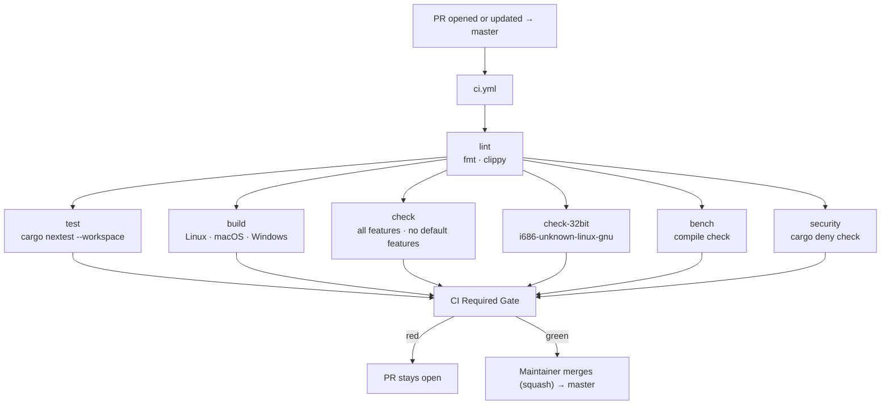
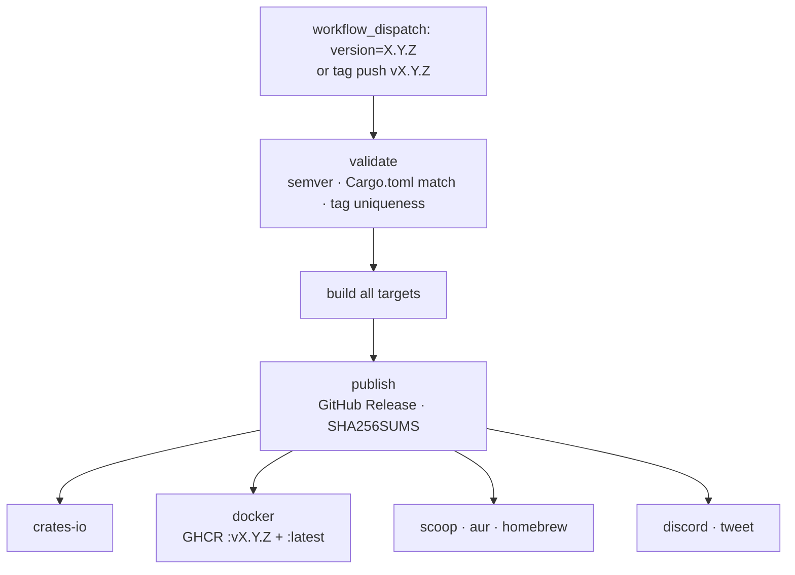

# Master Branch Delivery Flows

How code moves from a PR to a shipped release.

Use with:

- [`docs/book/src/maintainers/ci-and-actions.md`](../../docs/book/src/maintainers/ci-and-actions.md)
- [`docs/book/src/maintainers/release-runbook.md`](../../docs/book/src/maintainers/release-runbook.md)

Last updated: **June 2026** (merge queue disabled on `master`; maintainers
merge directly. The `merge_group` CI plumbing is retained, so the queue can be
re-enabled from branch protection with no code change).

---

## Branching Model

ZeroClaw uses a single default branch: `master`. All contributor PRs target
`master` directly. There is no `dev` or promotion branch.

Maintainers with merge authority: `JordanTheJet`, `singlerider`, `Audacity88`, `WareWolf-MoonWall`, `Nillth`, and `tidux`.

---

## Active Workflows

| File | Trigger | Purpose |
|---|---|---|
| `ci.yml` | `pull_request` → `master`; `push` → `master`; `merge_group` (dormant) | Lint + test + build on PRs and trusted post-merge cache-warming runs. The `merge_group` trigger stays wired but never fires while the merge queue is disabled. |
| `release-stable-manual.yml` | `workflow_dispatch`, tag push `v*` | Stable release (manual, version-gated) |
| `cross-platform-build-manual.yml` | `workflow_dispatch` | Full platform build matrix (manual smoke check) |
| `cross-platform-clippy.yml` | `workflow_dispatch`; weekly schedule | Advisory macOS/Windows Clippy coverage, outside the required PR gate |
| `pr-path-labeler.yml` | `pull_request` lifecycle | Automatic path-based PR labeling |

---

## Event Summary

| Event | What runs |
|---|---|
| PR opened or updated against `master` | `ci.yml` (full lint + test + build) |
| PR added to the merge queue (`merge_group`) | **Inactive**: the merge queue is currently disabled. If re-enabled, `ci.yml` runs the full gate on a temporary `gh-readonly-queue/master/…` branch stacking the base + earlier queue entries + this PR. |
| Push to `master` | `ci.yml` (post-merge quality signal + trusted Rust cache warming) |
| Manual dispatch | `cross-platform-build-manual.yml`, `cross-platform-clippy.yml`, or `release-stable-manual.yml` |
| Tag push `vX.Y.Z` | `release-stable-manual.yml` (full release pipeline) |

There is no automatic release on merge. `ci.yml` does run after trusted
`master` pushes so post-merge Quality Gate runs can seed Rust caches for later
PRs, but releases remain intentional: either a manual dispatch or a deliberate
tag push.

---

## Step-by-Step

### 1) PR → `master`

1. Contributor opens or updates a PR targeting `master`.
2. `ci.yml` runs:
   - `lint`: `cargo fmt --all -- --check`, `cargo clippy --workspace
     --exclude zeroclaw-desktop --all-targets --features ci-all -- -D warnings`
     (PRs only).
   - `build`: matrix across `x86_64-unknown-linux-gnu`,
     `aarch64-apple-darwin`, `x86_64-pc-windows-msvc`.
   - `check`: matrix: all features + no default features.
   - `check-32bit`: `i686-unknown-linux-gnu`, no default features.
   - `bench`: benchmarks compile check.
   - `test`: `cargo nextest run --locked --workspace --exclude zeroclaw-desktop` on `ubuntu-latest`.
   - `security`: `cargo deny check`.
   - `CI Required Gate`: composite job; branch protection requires this.
3. Maintainer reviews. Once the gate is green and review policy is satisfied,
   the maintainer merges the PR directly (squash).

> **Merge queue (currently disabled).** `master` previously *required* a merge
> queue, which serialized landings and re-tested each PR against the latest base
> on a temporary `gh-readonly-queue/master/…` branch before it could land. It is
> disabled for now; maintainers merge directly. The `merge_group` trigger in
> `ci.yml` is retained, so re-enabling is a one-click branch-protection toggle
> ("Require merge queue" on the `master` rule) with no code change.

### 2) Stable Release (manual)

See [`docs/book/src/maintainers/release-runbook.md`](../../docs/book/src/maintainers/release-runbook.md)
for the full procedure. In summary:

1. Maintainer verifies CI is green on the version bump PR.
2. Version bump PR is merged.
3. Maintainer triggers `release-stable-manual.yml` via `workflow_dispatch`
   with the version number, or pushes an annotated tag `vX.Y.Z`.
4. Workflow builds all targets, creates the GitHub Release, publishes to
   crates.io, pushes Docker images, and notifies distribution channels.
5. Maintainer approves the three environment gates
   (`github-releases`, `crates-io`, `docker`) when prompted.

### 3) Full Platform Build (manual)

1. Maintainer runs `cross-platform-build-manual.yml` via `workflow_dispatch`.
2. Build-only across additional targets not covered by the PR build matrix.
3. No tests, no publish. Used to verify cross-compilation health.

---

## Build Targets by Workflow

| Target | `ci.yml` | `cross-platform-build-manual.yml` | `release-stable-manual.yml` |
|---|:---:|:---:|:---:|
| `x86_64-unknown-linux-gnu` | ✓ | ✓ | ✓ |
| `aarch64-unknown-linux-gnu` | | ✓ | ✓ |
| `armv7-unknown-linux-gnueabihf` | | ✓ | ✓ |
| `arm-unknown-linux-gnueabihf` | | ✓ | ✓ |
| `aarch64-apple-darwin` | ✓ | ✓ | ✓ |
| `aarch64-linux-android` | | ✓ | ✓ (experimental) |
| `x86_64-apple-darwin` | | ✓ | ✓ |
| `x86_64-pc-windows-msvc` | ✓ | ✓ | ✓ |

---

## Diagrams

### PR to master

### Stable release

---

## Troubleshooting

1. **Gate red on PR**: check the `lint` job first (fmt/clippy failures are
   the most common cause), then `test`, then `build`.
2. **Release validate failed**: `Cargo.toml` version does not match the
   input, or the tag already exists. Fix the version bump PR and re-trigger.
3. **Need a full cross-platform build**: run `cross-platform-build-manual.yml`
   manually from the Actions tab.
