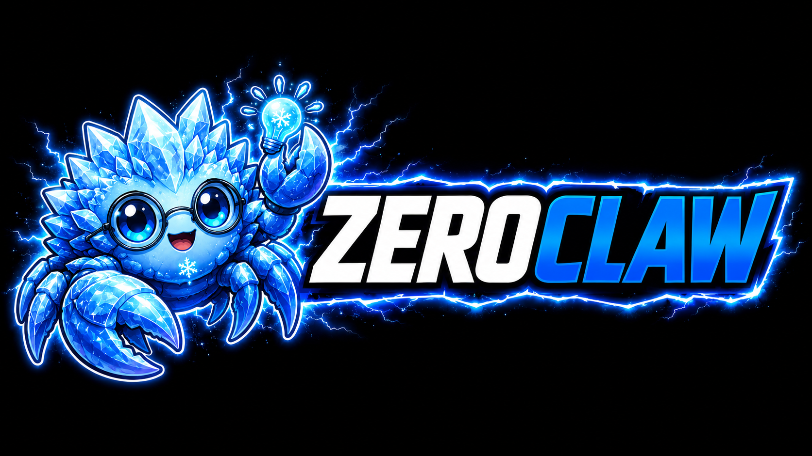

<p align="center">
  
</p>

<h1 align="center">🦀 ZeroClaw — Personal AI Assistant</h1>

<p align="center">
  <strong>You own the agent. You own the data. You own the machine it runs on.</strong>
</p>

<p align="center">
  <a href="https://github.com/zeroclaw-labs/zeroclaw/actions/workflows/ci.yml"></a>
  <a href="https://github.com/zeroclaw-labs/zeroclaw/releases/latest"></a>
  <a href="LICENSE-APACHE"></a>
  <a href="https://www.rust-lang.org"></a>
  <a href="https://github.com/zeroclaw-labs/zeroclaw/graphs/contributors"></a>
  <a href="https://discord.gg/zeroclaw"></a>
</p>

<p align="center">
  <a href="https://docs.zeroclawlabs.ai/master/en/introduction.html">Docs</a> ·
  <a href="docs/book/src/philosophy/index.md">Philosophy</a> ·
  <a href="docs/book/src/getting-started/quickstart.md">Quick start</a> ·
  <a href="docs/book/src/architecture/overview.md">Architecture</a> ·
  <a href="https://discord.gg/zeroclaw">Discord</a>
</p>

---

ZeroClaw is an agent runtime — a single Rust binary you configure and run. It talks to LLM providers (Anthropic, OpenAI, Ollama, and ~20 others), reaches the world through 30+ channels (Discord, Telegram, Matrix, email, voice, webhooks, your own CLI), and acts through tools (shell, browser, HTTP, hardware, custom MCP servers). Everything runs on your machine, with your keys, in your workspace.

Read the [Philosophy](docs/book/src/philosophy/index.md) for the four opinions that shape it.

## Install

```bash
curl -fsSL https://raw.githubusercontent.com/zeroclaw-labs/zeroclaw/master/install.sh | bash
```

Or clone and run:

```bash
git clone https://github.com/zeroclaw-labs/zeroclaw.git
cd zeroclaw
./install.sh
```

The installer asks whether you want a prebuilt binary (fast, ~seconds) or a source build (slower, customisable). Both end the same way: `zeroclaw quickstart` kicks off automatically.

> **Working on the docs?** The translated documentation catalogues live in a
> git submodule (`docs/book/po`). The Rust build does not need it, but building
> or syncing the docs does. Clone with it, or add it to an existing clone:
>
> ```bash
> git clone --recurse-submodules https://github.com/zeroclaw-labs/zeroclaw.git
> git submodule update --init docs/book/po   # existing clone
> ```

Flags:

```
./install.sh --prebuilt              # always prebuilt; don't ask
./install.sh --source                # always build from source
./install.sh --preset minimal        # kernel-only source preset (~6.6 MB)
./install.sh --minimal               # alias for --preset minimal
./install.sh --source --features agent-runtime,channel-discord  # custom feature set
./install.sh --apps zerocode         # select apps to install; use "none" to skip all
./install.sh --without-tui           # skip building zerocode
./install.sh --with-gateway          # force gateway support on
./install.sh --without-gateway       # force gateway support off
./install.sh --prefix /tmp/zc-test   # install under a custom prefix
./install.sh --dry-run --prebuilt    # preview without installing
./install.sh --skip-quickstart       # install only, run `zeroclaw quickstart` later
./install.sh --list-features         # print available feature flags
./install.sh --uninstall             # remove ZeroClaw
```

Platform-specific notes: [Linux](docs/book/src/setup/linux.md) · [macOS](docs/book/src/setup/macos.md) · [Windows](docs/book/src/setup/windows.md) · [FreeBSD](docs/book/src/setup/freebsd.md) · [NixOS](docs/book/src/setup/nixos.md) · [Docker](docs/book/src/setup/container.md)

## Quick start

```bash
zeroclaw quickstart               # one-shot setup: pick a provider, write a working config
zeroclaw agent -a <alias>         # interactive chat using the [agents.<alias>] entry
zeroclaw service install          # register as systemd/launchctl/Windows Service
zeroclaw service start            # run it always-on in the background
```

Full walkthrough: [Quick start](docs/book/src/getting-started/quickstart.md) — or skip the safety gates with [YOLO mode](docs/book/src/getting-started/yolo.md) for dev boxes.

## What ZeroClaw does

- **Multi-channel** — one agent answering you across [every channel you configure](docs/book/src/channels/overview.md). Inbound messages from Discord, Telegram, Matrix, email, webhooks, CLI — all delivered to the same agent loop.
- **Provider-agnostic** — [model providers](docs/book/src/providers/overview.md) are pluggable. Configure Anthropic, OpenAI, local Ollama, or any OpenAI-compatible endpoint. [Fallback chains and routing](docs/book/src/providers/routing.md) keep the agent running when a provider flakes.
- **Security-first, with escape hatches** — default autonomy is `supervised`: medium-risk ops require approval, high-risk blocked. Workspace boundaries, command policy, OS-level sandboxes (Landlock / Bubblewrap / Seatbelt / Docker), and cryptographic [tool receipts](docs/book/src/security/tool-receipts.md) on every action. [YOLO mode](docs/book/src/getting-started/yolo.md) exists for trusted dev environments.
- **Hardware-capable** — GPIO / I2C / SPI / USB on Raspberry Pi, STM32, Arduino, and ESP32 via the `Peripheral` trait. See [Hardware](docs/book/src/hardware/index.md).
- **Gateway + dashboard** — HTTP / WebSocket gateway for clients, with a web dashboard for chat, memory browsing, config editing, cron management, and tool inspection.
- **SOP engine** — event-triggered [Standard Operating Procedures](docs/book/src/sop/index.md) (MQTT / webhook / cron / peripheral) with approval gates and resumable runs.
- **ACP** — IDE / editor integration via [Agent Client Protocol](docs/book/src/channels/acp.md) (JSON-RPC 2.0 over stdio).

## Configuration

One TOML file at `~/.zeroclaw/config.toml`. Pointers:

- [Provider configuration](docs/book/src/providers/configuration.md) — the universal `[providers.models.<type>.<alias>]` schema
- [Channels overview](docs/book/src/channels/overview.md) — per-channel `[channels.<type>.<alias>]` blocks
- [Security overview](docs/book/src/security/overview.md) — autonomy, sandboxing, tool receipts
- [Full config reference](https://docs.zeroclawlabs.ai/master/en/reference/config.html) — generated from the live schema; every key documented

A V3 config has at minimum four section headers (`<type>.<alias>` shaped) — a provider entry, an agent that references it, and a risk profile the agent gates against. See [Provider Configuration → Minimal working example](docs/book/src/providers/configuration.md#minimal-working-example) for the canonical four-section form with inline type/alias commentary.

For standard OpenAI Codex subscription auth, swap the provider entry to:

```toml
[providers.models.openai.coding]   # type = openai; alias = coding (you choose)
model = "gpt-5-codex"
wire_api = "responses"
requires_openai_auth = true
```

…and point your agent at it with `model_provider = "openai.coding"`.

Notes:

- Normal OpenAI Codex subscription auth uses stored auth profiles, not an `api_key` on the provider entry.
- Only set `api_key` / `uri` on `[providers.models.openai.<alias>]` when intentionally targeting a custom OpenAI-compatible gateway or endpoint.
- If you see `provider streaming failed, falling back to non-streaming chat`, ZeroClaw retries the same request in non-streaming mode. Check `zeroclaw auth status` before changing provider config.

## Architecture

```
┌──────────────────────────────────────────────────────────────┐
│            channels       gateway        ACP                 │
│          (30+ adapters)   (REST/WS)    (JSON-RPC)            │
│                        ↓                                     │
│                   ZeroClaw runtime                           │
│         ┌──────────┬──────────┬──────────┐                   │
│         │  agent   │ security │   SOP    │                   │
│         │   loop   │  policy  │  engine  │                   │
│         └──────────┴──────────┴──────────┘                   │
│              ↓          ↓           ↓                        │
│          providers    tools      memory                      │
│         (Anthropic,  (shell,    (SQLite,                     │
│          OpenAI,     browser,    embeddings)                 │
│          Ollama,     HTTP,                                   │
│          ~20 more)   hardware)                               │
└──────────────────────────────────────────────────────────────┘
```

Full detail with Mermaid diagrams: [Architecture overview](docs/book/src/architecture/overview.md) · [Request lifecycle](docs/book/src/architecture/request-lifecycle.md) · [Crates](docs/book/src/architecture/crates.md).

## Contributing

Start with [how to contribute](docs/book/src/contributing/how-to.md). Larger changes go through the [RFC process](docs/book/src/contributing/rfcs.md). Real-time chat lives on [Discord](https://discord.gg/zeroclaw) (the best way to reach the team); durable work tracking is on [GitHub issues](https://github.com/zeroclaw-labs/zeroclaw/issues).

Good places to start:

- New channel → `crates/zeroclaw-channels/`
- New provider → `crates/zeroclaw-providers/`
- New tool → `crates/zeroclaw-tools/`
- Hardware support → `crates/zeroclaw-hardware/`
- Docs → `docs/book/src/`

AI-assisted PRs are welcome; see [Contribution culture (RFC #5615)](https://github.com/zeroclaw-labs/zeroclaw/issues/5615) for the co-authorship norms.

<!-- BEGIN:RECENT_CONTRIBUTORS -->
<!-- END:RECENT_CONTRIBUTORS -->

## Security

Do not file public issues for security vulnerabilities. Email `security@zeroclaw.dev`. See [SECURITY.md](SECURITY.md) for the full policy.

## Official repository & impersonation notice

This is the only official ZeroClaw repository:

> <https://github.com/zeroclaw-labs/zeroclaw>

Any other repository, organization, domain, or package claiming to be "ZeroClaw" or implying affiliation with ZeroClaw Labs is **unauthorized and not affiliated with this project**.

## License

Dual-licensed: [MIT](LICENSE-MIT) OR [Apache 2.0](LICENSE-APACHE). You may choose either. Contributors automatically grant rights under both — see [CLA](docs/book/src/contributing/cla.md). The **ZeroClaw** name and logo are trademarks of ZeroClaw Labs.

## Credits

Built and maintained by the community — original creator [@theonlyhennygod](https://github.com/theonlyhennygod); project lead [@JordanTheJet](https://github.com/JordanTheJet). Full maintainer list in [Communication](docs/book/src/contributing/communication.md).

Thanks to the communities that incubated early work: **Harvard University**, **MIT**, **Sundai Club**, and every contributor pushing it forward.

<p align="center">
  <a href="https://www.star-history.com/#zeroclaw-labs/zeroclaw&type=date&legend=top-left">
    <picture>
     <source media="(prefers-color-scheme: dark)" srcset="https://api.star-history.com/svg?repos=zeroclaw-labs/zeroclaw&type=date&theme=dark&legend=top-left" />
     <source media="(prefers-color-scheme: light)" srcset="https://api.star-history.com/svg?repos=zeroclaw-labs/zeroclaw&type=date&legend=top-left" />
     
    </picture>
  </a>
</p>

<p align="center">
  <a href="https://github.com/zeroclaw-labs/zeroclaw/graphs/contributors">
    
  </a>
</p>
