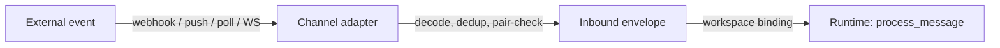
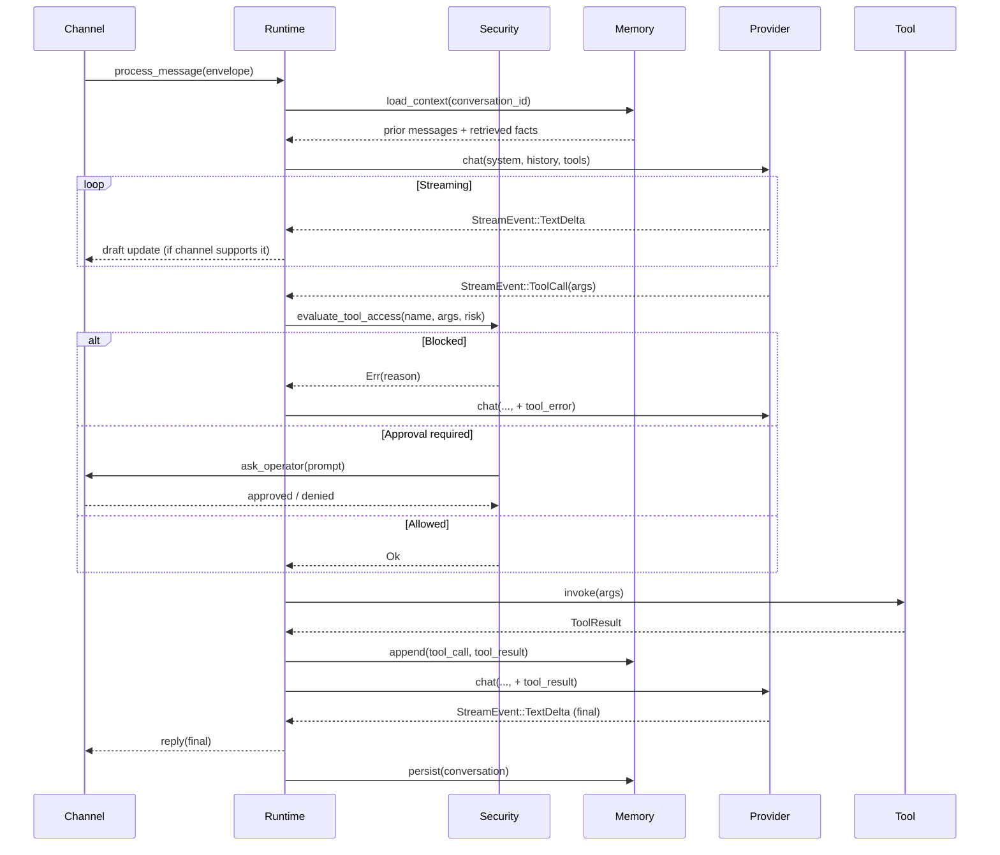

# Request Lifecycle

What happens between "user sends a message" and "agent replies": the full path, with streaming, tool calls, and security gates annotated.

## Inbound

A channel adapter (e.g. `discord.rs`, `telegram.rs`, `email_channel.rs`) receives platform-native events and converts them into a uniform inbound envelope. The adapter handles:

- **Decoding**: platform-specific payload → canonical message format
- **Deduplication**: prevents replaying the same message twice (restarts, retries)
- **Pair-check**: enforces the `[channels.<name>.allowed_users]` / IAM policy before the event reaches the runtime

If the channel is not paired or the user isn't allowed, the event is dropped before the runtime sees it.

## Agent loop

Key properties:

- **Streaming is end-to-end.** The provider streams tokens. If the channel adapter reports `supports_draft_updates()`, the runtime edits a sent message in place as text arrives. Discord, Slack, and Telegram support this.
- **Tool calls are mid-stream.** The model can emit a tool call while still generating text. The runtime pauses the stream, validates, invokes, feeds the result back, and resumes.
- **Security gates every tool call.** `evaluate_tool_access` consults the [autonomy level](../security/autonomy.md), allow/deny lists, and path boundaries. Medium-risk calls under `Supervised` autonomy go to the operator-approval path.
- **Memory is persistent.** The conversation, tool calls, and tool results are written to the memory backend. (Receipts ride in-band in the conversation text rather than as a separate persisted artifact.)

## Tool receipts

Successful tool executions can receive an HMAC-SHA256 receipt that is appended to the tool-result text and passed back to the model in the conversation, proving the signed result came from the runtime. The HMAC is keyed by an ephemeral in-memory key and computed over `tool_name || args || result || timestamp`. Receipts are not written to a separate on-disk log and are not chained; the model can echo them but cannot forge a new valid one without the key. See [Tool receipts](../security/tool-receipts.md).

## Outbound

Outbound messages go back through the same channel adapter. Adapters with multi-message support (Discord, Slack) can stream long replies as a sequence of messages; others (email, SMS) flush on stream completion.

## Where it lives in code

- Agent loop: `crates/zeroclaw-runtime/src/agent/turn/` (`run_tool_call_loop`), with entry points in `crates/zeroclaw-runtime/src/agent/loop_.rs` (`process_message`, `run`)
- Tool-call access checks: `crates/zeroclaw-runtime/src/security/` (`iam_policy.rs` `evaluate_tool_access`)
- Channel orchestration: `crates/zeroclaw-channels/src/orchestrator/`
- Provider streaming: `crates/zeroclaw-api/src/model_provider.rs` (`StreamEvent` enum, re-exported from `zeroclaw-providers`), `compatible.rs` (SSE parser)

Since #7415, every transport (channels, CLI, cron, gateway WebSocket, RPC/zerocode, ACP, and the embedded `Agent` API) runs the same turn engine: `run_tool_call_loop` in `crates/zeroclaw-runtime/src/agent/turn/`. The streaming and embedded entry points are thin wrappers in `agent.rs` that set per-caller knobs (dedup, iteration-cap behavior, event emission) around the shared loop. The `turn/` module is one file per step:

| File(s) | Step |
|---|---|
| `mod.rs` | orchestrator: iteration control, knobs, steering drain |
| `history_window.rs` · `tool_specs.rs` · `vision_route.rs` | pre-call: history maintenance, tool specs, vision routing |
| `provider_call.rs` · `stream_consume.rs` · `stream_guard.rs` | the LLM call, stream consumption, mid-stream protocol guarding |
| `parse_response.rs` · `protocol_detect.rs` · `context_recovery.rs` | response interpretation, parse-issue detection, overflow recovery |
| `approval_gate.rs` · `call_prep.rs` | tool-call approval and preparation (dedup, hooks, delivery defaults) |
| `post_exec.rs` · `results_collect.rs` · `history_append.rs` · `max_iter.rs` | result recording, loop detection, history append, iteration cap |
| `context.rs` · `events.rs` · `knobs.rs` · `steering.rs` · `outcome.rs` · `redact.rs` · `delivery_defaults.rs` | shared types: turn context, events, per-caller knobs, steering, outcomes, credential scrubbing |
