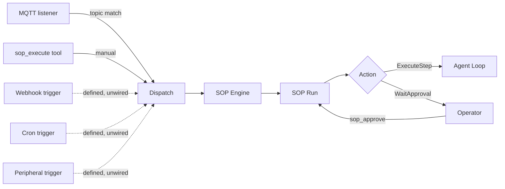

# How SOPs run

## Runtime contract

- SOP definitions are loaded from `<workspace>/sops/<sop_name>/SOP.toml` plus optional `SOP.md`.
- CLI `zeroclaw sop` currently manages definitions only: `list`, `validate`, `show`.
- SOP runs are started by a live event fan-in (MQTT, filesystem, or AMQP) or by the in-agent tool `sop_execute`. Other trigger types are defined and matched but not yet wired to a live event source (see [SOP Fan-In](./fan-in/overview.md)).
- Run progression uses tools: `sop_status`, `sop_approve`, `sop_advance`.
- SOP audit records are persisted in the configured Memory backend under category `sop`.

## Event flow



## Getting started

1. Set the SOP directory through the gateway, zerocode, or `zeroclaw config set` (required for runtime SOP loading):

2. Create a SOP directory, for example:

   ```text
   ~/.zeroclaw/workspace/sops/deploy-prod/SOP.toml
   ~/.zeroclaw/workspace/sops/deploy-prod/SOP.md
   ```

3. Validate and inspect definitions:

   <div class="os-tabs-src">

   #### sh

   ```sh
   zeroclaw sop list
   zeroclaw sop validate
   zeroclaw sop show deploy-prod
   ```

   </div>

4. Trigger runs via configured event sources, or manually from an agent turn with `sop_execute`.

For trigger routing and auth details, see [SOP Fan-In](./fan-in/overview.md).
